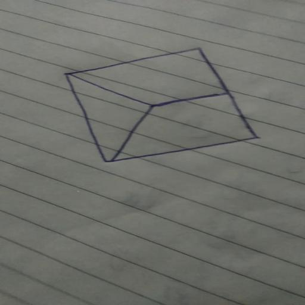
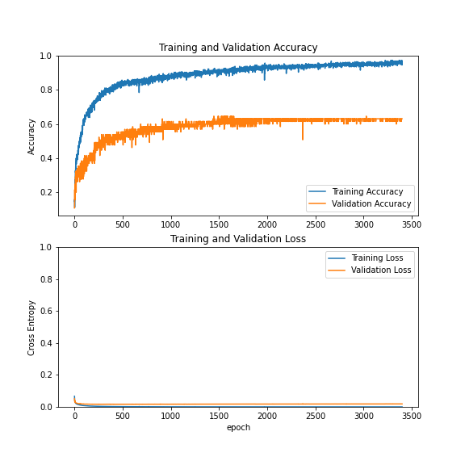
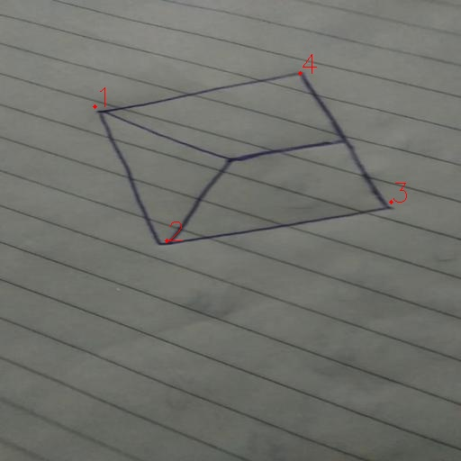

# Posebox : 

A machine learning approach for pose estimation of hand-drawn marker

## Details
Pose estimation is a costly operation and often requires additional harware like depth sensor for accuracy for plane detection.
This project is an attempt to build a computationally cheap, no additional hardware dependency and realtime
pose estimation of a fixed hand-drawn marker. 

(_cause let's be honest, not everyone owns a printer_)


### Prerequisites

Checkout [requirements.txt](requirements.txt) for specifics

## Data

The training data contains a specific marker hand drawn on paper and annotated always in a particular order.

For example:



## Model

```
Model: "sequential"
_________________________________________________________________
Layer (type)                 Output Shape              Param #   
=================================================================
conv2d (Conv2D)              (None, 511, 511, 3)       39        
_________________________________________________________________
max_pooling2d (MaxPooling2D) (None, 255, 255, 3)       0         
_________________________________________________________________
conv2d_1 (Conv2D)            (None, 254, 254, 3)       39        
_________________________________________________________________
max_pooling2d_1 (MaxPooling2 (None, 127, 127, 3)       0         
_________________________________________________________________
mobilenetv2_1.00_224 (Model) (None, 4, 4, 1280)        2257984   
_________________________________________________________________
flatten (Flatten)            (None, 20480)             0         
_________________________________________________________________
dense (Dense)                (None, 64)                1310784   
_________________________________________________________________
dense_1 (Dense)              (None, 32)                2080      
_________________________________________________________________
dense_2 (Dense)              (None, 16)                528       
_________________________________________________________________
dense_3 (Dense)              (None, 8)                 136       
=================================================================
Total params: 3,571,590
Trainable params: 1,313,606
Non-trainable params: 2,257,984
_________________________________________________________________

```

## Training

Training was done on manually captured and annotated dataset containing 325 images.
Model was trained using Google Colab and checkpoints were saved on google drive.

Accuracy and Loss:



## Inference

Images are resized to 512 x 512 before being fed to the model. The results are regression coordinates in float between 0 to 1
which are then scaled as per the original dimension of the image.

Result from the model:

 

The points of the marker are numbered in the same manner as the annotation. 

It is to note that the order of points in crucial and therefore must be ensured in the annotation process as well.

## Versioning

We use [SemVer](http://semver.org/) for versioning. For the versions available, see the [tags on this repository](https://github.com/sanjeev309/posebox/tags). 

## Authors

[Sanjeev Tripathi](https://www.linkedin.com/in/sanjeev309/)

[Harshini Gudipally](https://www.linkedin.com/in/harshini-gudipally/)


## License

This project is licensed under the GNU GPL V3 - see the [LICENSE.md](LICENSE.md) file for details
